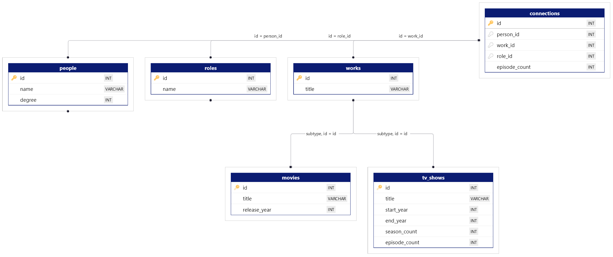

# The Fey Factor

A funsies project inspired by [Six Degrees of Kevin Bacon](https://en.wikipedia.org/wiki/Six_Degrees_of_Kevin_Bacon) but for finding and assessing live-action, scripted American<sup>1</sup> comedies based on their proximity and strength of connections to Tina Fey<sup>2</sup>.

## 1. Data Builder
This package contains a bunch of code that ultimately culminates in a collection of Node scripts run from a single console app to collect data from [The Movie Database API](https://developer.themoviedb.org/) starting from Tina Fey (or a person of your choice) and collecting TV shows, movies, and people to the specified "degree of separation." **This is currently focused primarily on TV shows** - movies are limited to degree 1 (even that collects thousands) and movie data is not topped up after initial population; options only exist to top-up TV show data. 

The raw data is saved locally as JSON files in the `datasources/cache` folder. If a file is found, that data will be used instead of making an API request to TMDB, to keep API calls to a minimum. (However, these cached files are excluded from version control.)

The inclusion criteria are basic, so this should be considered a beta proof-of-concept. (Including every single person and continuing the tree results in too many people and works to be practical, but the current criteria are very arbitrary. I somewhat work around this using the scripts that "top up" data for a specified number of shows and for degree 2 people who would be degree 1 under looser criteria, but this is not a perfect solution.)

### Prerequisites
- [Node](https://nodejs.org)
- Postgres database server (the database itself is created by the script)
- [TMDB API key](https://developer.themoviedb.org/docs/getting-started)

### Setup
```bash
cd builder
npm install
```
- Postgres settings in `src/database/DatabaseConnection.ts``
- TMDB API key as `TMDB_AUTH_TOKEN` in `.env`.

### Usage
Ensure Postgres is running, and then run the interactive console script:
```bash
npm run start
```
For first run, arrow down to the "danger zone" and choose the "Initialise empty database" option. After that, the prompts are designed to be fairly self-explanatory and show the intended order of data population steps.

### Result

The resultant database schema is intentionally minimal, with a focus on raw data, low redundancy, and primarily storing data that is unlikely to change* and project-specific custom data (e.g., degree of separation, show ratings). Calculations, derived data, and fetching time-sensitive data (such as watch providers) are handled at the GraphQL layer.



**Note:** Work/TV show/Movie IDs are actually `varchar`s now - I just haven't updated the diagram. See [A note about work IDs](#a-note-about-work-ids) below for more information.

| Table name  | Inherits from | Unique fields                                     | Foreign keys                |
|-------------|---------------|---------------------------------------------------|-----------------------------|
| connections | -             | id (PK), episode_count                            | person_id, work_id, role_id |
| people      | -             | id (PK), name, degree                             |                             |
| roles       | -             | id (PK), name                                     |                             |
| works       | -             | id (PK), title                                    |                             |
| tv_shows    | works         | start_year, end_year, season_count, episode_count |                             |
| movies      | works         | release_year                                      |                             |


*The database does need to be updated periodically or else the data will go out of date, just in terms of shows still airing at the time of last update, new shows that should be added, etc. We don't need to fetch the episode count of _30 Rock_ from TMDB every time it appears in the app, for example - so we store that; but where we can watch it may change relatively frequently, so we don't store that.

### A note about work IDs

TMDB IDs are used as the primary key for works (TV shows and movies) in the database. I discovered after I designed this that they are not unique - a TV show and a movie can have the same ID, which as you can imagine, is an absolute pain. My solution is to append the ID with `_T` for TV show or `_F` for film, which I'm aware is a dirty hack but I was too invested in my database design by the time I discovered this to implement an objectively better solution. 

My way of doing this as cleanly as possible is to:
- handle this suffix centrally in the database class only, not in the data population scripts
- include a check constraint in the database to enforce correctly suffixed IDs (i.e., no missing, doubled-up, other letters).

Caveats this introduces:
- When an episode count is not available for a TV show connection, 0 must be used instead of `null`, because `null` is my shortcut way of differentiating that a work is a movie.

---
## 2. Back-end server

The back-end is a GraphQL server built with [Yoga](https://the-guild.dev/graphql/yoga-server) because I need more practice with GraphQL. ¯\\_(ツ)_/¯

### Development

#### Generating schema and types

I have created a script to generate TypeScript types and GraphQL schema from the database which should be run on fresh installs or if the database schema is changed.
```bash
npm run generate:schema
```
Under the hood, this: 
1. uses [pg-to-ts](https://www.npmjs.com/package/pg-to-ts) to do an initial generation of TypeScript interfaces from the database schema,
2. does a manual find-and-replace for some known table name to entity name discrepancies (largely around the database tables being named as plurals like "people" and "roles" but because the code will refer to individual items, I want the types to be "person" and "role"), and
3. does some manual processing of the types to create the matching definitions for GraphQL schema, and writes them to a separate file.
   - This includes assessing foreign keys in the database tables and adding fields to the GraphQL schema to allow for querying related data.

The generated files can then be found in `./src/generated`.

Fields not included in the database schema should be added in the `src/types.ts` file to be included in the generated schema.

#### Adding fields

As mentioned [above](#1-data-builder), the database schema is intentionally minimal, with a focus on raw data and low redundancy. What is not included in the database (whether explicitly or at all) includes:

- fields that are calculated or derived from the data in the database
- fields for data that is fetched from an external source (e.g., TMDB API).

To add a field to the GraphQL schema that doesn't belong in the database, add it to the `src/types.ts` file and re-run the generator.

#### Generating resolver skeletons

I have also created a script to generate skeletons/templates for resolvers based on the generated schema and likely function names.

It skips any types that already have a resolver file, so it can be run when adding new types without overwriting existing resolvers.

**Note:** It also intentionally skips types from a manually set list - see `generate-resolver-skeleton.ts` to see and adjust this list if needed.

```bash
npm run generate:resolvers
```

### Troubleshooting

- `Exception thrown about Punycode when running scripts on Node 21.`
  - Change Node version to 20 LTS (`nvm use lts/iron`).

- After deleting resolver files to re-create them, the script says it's created them and `existsSync` returns `true`, but the files aren't actually there. `unlinkSync` throws an error.
  - Try killing all Node processes, restarting WSL, and/or restarting computer.

#### Miscellaneous notes

- Watch provider data is automatically filtered for Australia before it's returned to the GraphQL client. 

---
## 3. Front-end app

The plan is that the UI will contain:
- Sortable and filterable ranking tables
- A Venn diagram showing the people overlap between shows
- A network graph showing connections between shows and people.

Combine the generated schema from Step 2, run the Relay compiler, and run the Vite dev server in one step with:
```bash
npm run dev
```

Under the hood, it is a [React](https://react.dev/) app with [Relay](https://relay.dev/) for GraphQL queries, because that's what I use at my day job and thus want to  practice with. Built using [Vite](https://vitejs.dev/), with thanks to Oscar Beaumont for [vite-plugin-relay](https://github.com/oscartbeaumont/vite-plugin-relay).

UI components are home-made using [Styled Components](https://styled-components.com/) and [Polished](https://polished.js.org/), with thanks to Armin Broubakarian for [generate-react-cli](https://www.npmjs.com/package/generate-react-cli) which I use to bootstrap my components.

---

## Credits


This product uses the TMDB API but is not endorsed or certified by TMDB.


## Footnotes 
<sup>1</sup>Currently only TV shows are filtered by origin country, not movies. 

<sup>2</sup>It can actually be run with anyone as your start person, you just need their TMDB ID. You may also need to adjust the code, e.g., my next implementation will be for Australian TV so I will need to adjust the country filter. 
```
