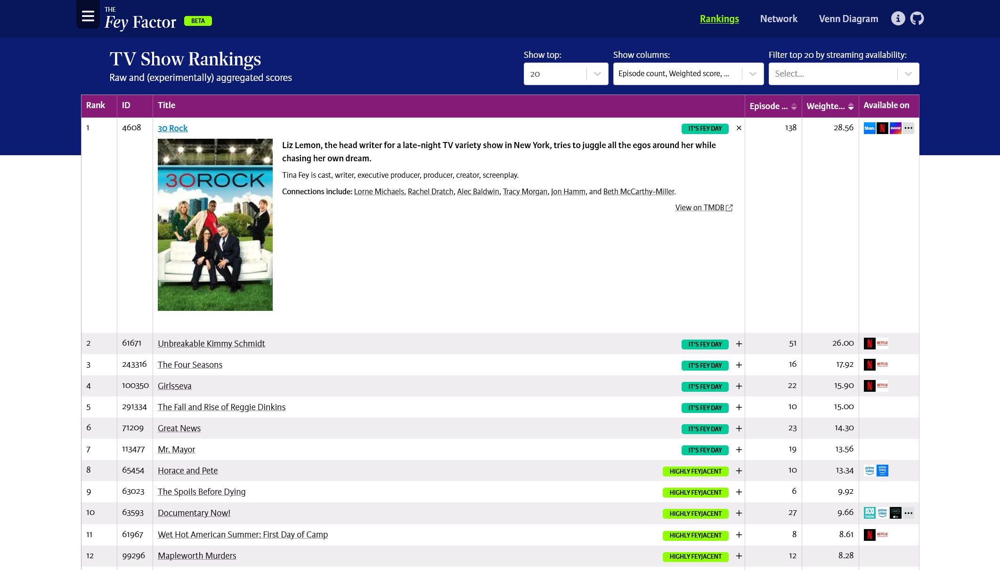
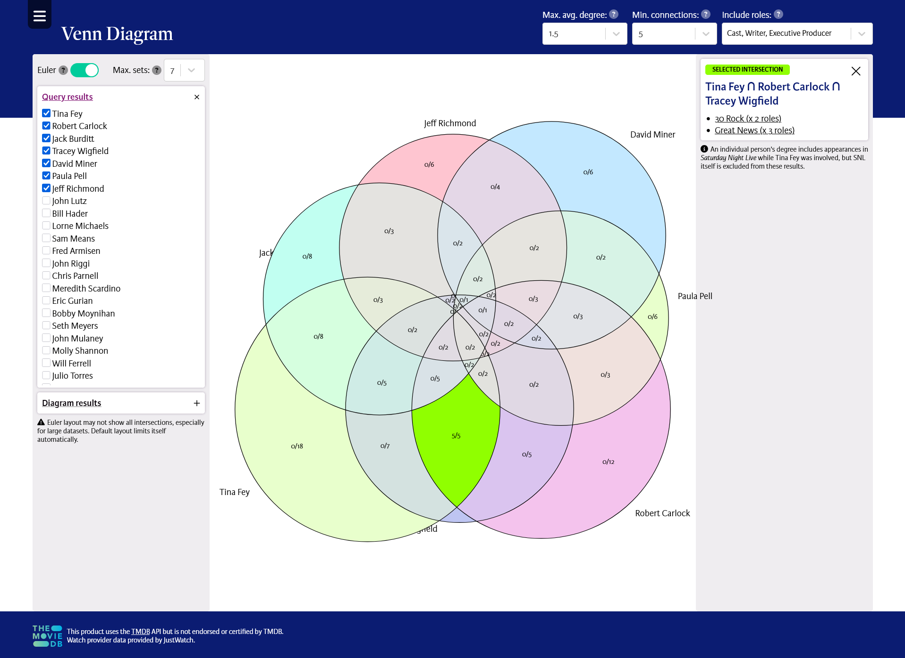

# The Fey Factor

A funsies project inspired by [Six Degrees of Kevin Bacon](https://en.wikipedia.org/wiki/Six_Degrees_of_Kevin_Bacon) but for finding and assessing live-action, scripted American[^1] comedies based on their proximity and strength of connections to Tina Fey[^2].

## Background

My partner and I are frequently looking for new (to us) TV comedies to watch. Trying to choose from streaming services often left us paralysed by choice, and of those shows we did like we started noticing a pattern of the faces and names that were becoming more familiar, especially those appearing together. He started proposing certain shows based on "a promising Venn diagram" or describing a show as "Feyjacent". I started developing a vague hypothesis that “All the best American TV comedy made in the last 25 years exists within 2 degrees of Tina Fey”[^3], and also thought, what if I could build the Venn diagram?[^4]

Note: This can be run with anyone as your start person, you just need their TMDB ID. You may also need to adjust the code because of some of the arbitrary values I've selected and bits that might not be relevant to your use case (e.g., special handling for _Saturday Night Live_, filtering by production country).

## Implementation

The project is made up of three parts:

| Step/layer         | Summary                                                                                                                                               | Docs                                       |
|--------------------|-------------------------------------------------------------------------------------------------------------------------------------------------------|--------------------------------------------|
| 1. Data builder    | Scripts to set up the database and collect the essential data.                                                                                        | [./builder/README.md](./builder/README.md) |
| 2. Back-end server | GraphQL server to be the intermediary between the database and front-end, as well as third-party APIs and the front-end for fetching additional data. | [./server/README.md](./server/README.md)   |
| 3. Front-end app   | React app to display the data and insights.                                                                                                           | [./app/README.md](./app/README.md)         |

Please see the README for each individual layer for more information about the tools and libraries used.

> [!IMPORTANT]
> This project was built on a Windows machine, originally using WSL (so Bash) but I've since gone all-in on PowerShell for my Windows terminal needs, so Mac and Linux users may need to make some minor adjustments accordingly. For the front-end app, Bash commands have already been provided alongside the default PowerShell ones - see the [app README](./app/README.md) and [package.json](./app/package.json) for details.

[^1]: Currently only TV shows are filtered by origin country, not movies.
[^2]: The original hypothesis before I started building this was 20 years and 3 degrees, but scaling back the amount of data collected when prototyping showed that 2 is a viable hypothesis, considering the sheer volume of data that 3 degrees collects; and I updated it to 25 years in 2026 to ensure _30 Rock_ and some notable other shows such as _The Office_ remain included.
[^3]: I am prepared to concede that the true centre of the Venn diagram, i.e., Degree 0) may actually be Michael Schur.
[^4]: We've ended up using the ranking table more than the actual diagram for choosing shows, but a version of the diagram is available. It is somewhat limited due to the complexity of the data and limitations of the graphing library I used, but it is fun to look at!

---

This product uses the TMDB API but is not endorsed or certified by TMDB.

Watch provider data is provided by [JustWatch](https://www.justwatch.com/) via TMDB.

